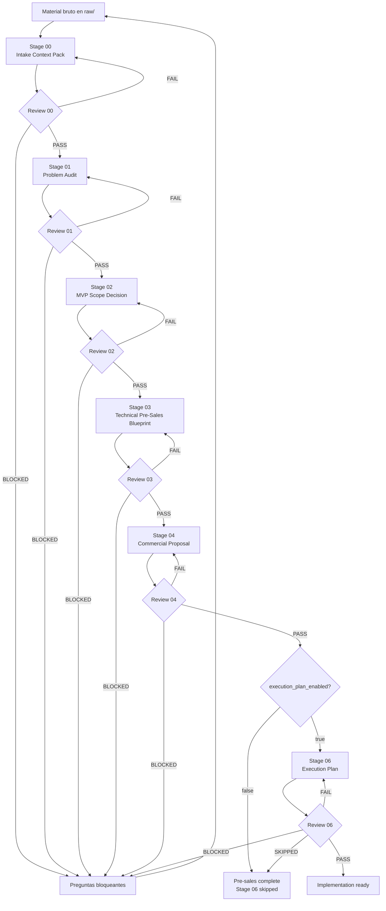
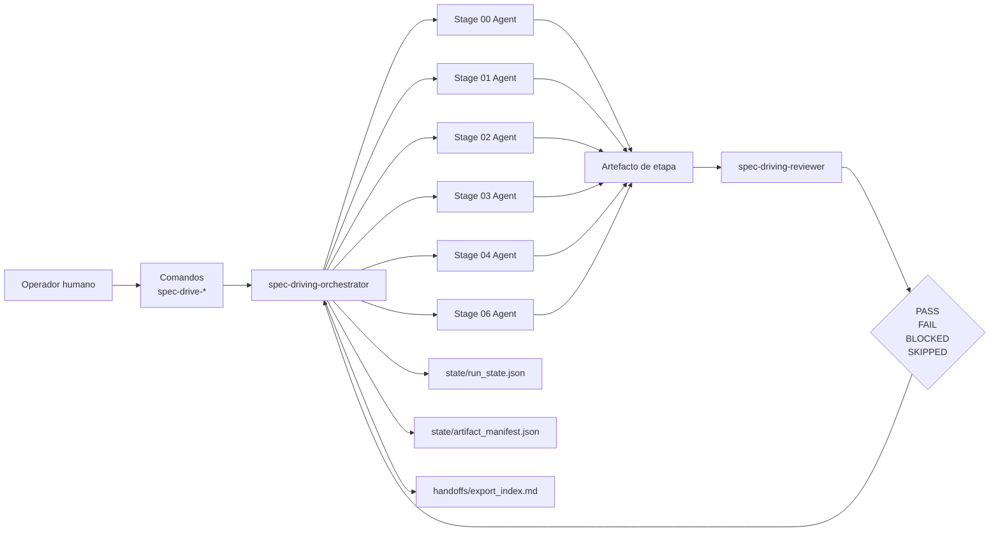
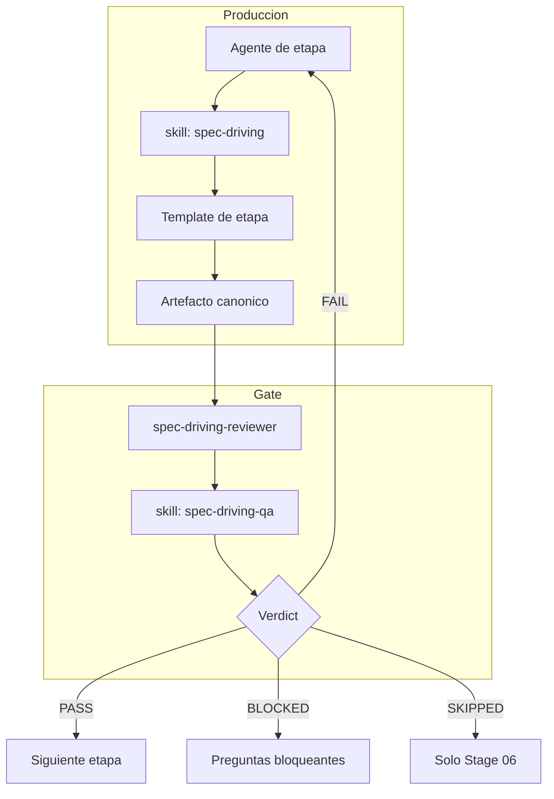
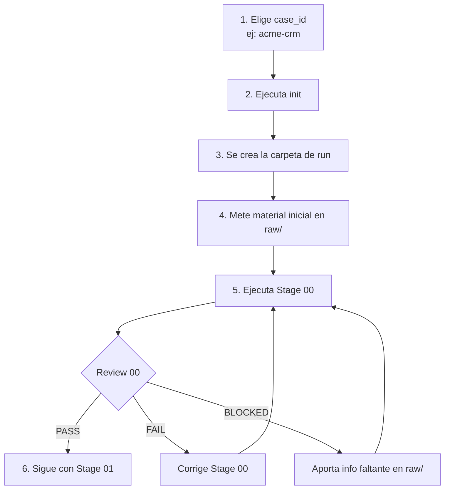

# Spec-Driven Flow

Flujo reutilizable para convertir material caótico de un cliente, producto o
proyecto en artefactos de preventa validados por etapas.

Este flujo extiende el harness general del repositorio. No sustituye
`01_harness/TASKFLOW.md`, no usa `00_inbox/` como contenedor principal de runs y
no crea artefactos de negocio de un caso real hasta que una run se inicializa
explícitamente.

## Qué Es Este Flujo

`spec-driving` es una mini cadena de trabajo con equipo, etapas, revisión y
estado interno.

La idea es separar tres cosas:

- El motor reutilizable vive en `shared/flows/spec-driving/`.
- Los agentes y skills reutilizables viven en `shared/agents/` y
  `shared/skills/`.
- Cada caso real vive aislado en `04_outputs/spec-driving/<case_id>/`.

El objetivo no es escribir directamente una propuesta comercial desde notas
desordenadas. El objetivo es pasar por una secuencia controlada:

1. ordenar el contexto;
2. auditar problemas reales;
3. decidir alcance MVP;
4. diseñar un blueprint técnico de preventa;
5. escribir la propuesta comercial;
6. crear un plan de ejecución solo si la run lo permite.

Cada etapa genera un artefacto principal. Ese artefacto debe pasar una revisión
real antes de que el orquestador pueda avanzar.

## Vista Visual del Flujo



Lectura rápida:

- Cada caja grande produce un artefacto.
- Cada rombo es un gate real de revisión.
- `FAIL` vuelve a la misma etapa.
- `BLOCKED` para la run hasta aportar información.
- Stage 06 solo existe si `execution_plan_enabled: true`.

## Fuente de Verdad

- Reglas del orquestador: `references/orchestrator-contract.md`
- Reglas de etapas: `references/stage-contract.md`
- Gate de revisión: `references/review-contract.md`
- Comportamiento de comandos: `references/command-contract.md`
- Plantillas de artefactos: `templates/`
- Schemas de estado: `schemas/`

Si hay duda entre una explicación resumida y un contrato, manda el contrato.

## El Equipo

El flujo se comporta como un pequeño equipo agentic.



El reparto es simple:

- El operador da intención y material.
- Los comandos activan el flujo.
- El orquestador coordina y actualiza estado.
- Los agentes de etapa producen artefactos.
- El reviewer decide si se puede avanzar.
- El estado y manifest dejan rastro operativo.

| Rol | Archivo | Responsabilidad |
| --- | --- | --- |
| Orquestador | `shared/agents/spec-driving-orchestrator/AGENT.md` | Coordina la run, lee estado, decide la siguiente acción, delega etapas y exige revisión. |
| Stage 00 | `shared/agents/spec-driving-stage-00-intake/AGENT.md` | Convierte material bruto en un pack de contexto trazable. |
| Stage 01 | `shared/agents/spec-driving-stage-01-problem-audit/AGENT.md` | Separa problemas reales de deseos, ideas vagas y supuestos. |
| Stage 02 | `shared/agents/spec-driving-stage-02-scope-decision/AGENT.md` | Decide qué entra en MVP, qué queda para fase 2 y qué queda fuera. |
| Stage 03 | `shared/agents/spec-driving-stage-03-presales-blueprint/AGENT.md` | Produce el blueprint técnico-funcional de preventa. |
| Stage 04 | `shared/agents/spec-driving-stage-04-commercial-proposal/AGENT.md` | Convierte el blueprint aprobado en propuesta comercial. |
| Stage 06 | `shared/agents/spec-driving-stage-06-execution-plan/AGENT.md` | Crea el plan de ejecución solo si está habilitado. |
| Reviewer | `shared/agents/spec-driving-reviewer/AGENT.md` | Revisa cada etapa con evidencia y devuelve `PASS`, `FAIL`, `BLOCKED` o `SKIPPED`. |

El orquestador no debe hacerlo todo. Su trabajo es coordinar. Los artefactos de
etapa pertenecen a los agentes de etapa. Las aprobaciones pertenecen al
reviewer.

## Skills

Hay dos skills principales:

- `shared/skills/spec-driving/`: reglas operativas del flujo, etapas,
  plantillas, estado y comportamiento general.
- `shared/skills/spec-driving-qa/`: reglas estrictas de QA para revisar
  artefactos y decidir si una etapa puede avanzar.

La skill `spec-driving` sirve para producir y coordinar. La skill
`spec-driving-qa` sirve para bloquear falsos avances.

## Mapa Etapa por Etapa

| Etapa | Agente productor | Skill principal | Artefacto | Gate |
| --- | --- | --- | --- | --- |
| 00 | `spec-driving-stage-00-intake` | `spec-driving` | `context/00_intake_context_pack.md` | `spec-driving-reviewer` + `spec-driving-qa` |
| 01 | `spec-driving-stage-01-problem-audit` | `spec-driving` | `artifacts/01_problem_audit_v1.md` | `spec-driving-reviewer` + `spec-driving-qa` |
| 02 | `spec-driving-stage-02-scope-decision` | `spec-driving` | `artifacts/02_mvp_scope_decision_v1.md` | `spec-driving-reviewer` + `spec-driving-qa` |
| 03 | `spec-driving-stage-03-presales-blueprint` | `spec-driving` | `artifacts/03_technical_presales_blueprint_v1.md` | `spec-driving-reviewer` + `spec-driving-qa` |
| 04 | `spec-driving-stage-04-commercial-proposal` | `spec-driving` | `artifacts/04_commercial_proposal_v1.md` | `spec-driving-reviewer` + `spec-driving-qa` |
| 06 | `spec-driving-stage-06-execution-plan` | `spec-driving` | `artifacts/06_execution_plan_v1.md` | `spec-driving-reviewer` + `spec-driving-qa` |



## Ubicación de Runs

Cada run vive en:

```text
04_outputs/spec-driving/<case_id>/
```

Cada run está pensada para ser trackeada en git, incluyendo material bruto,
estado, logs, reviews y artefactos.

## Estructura de Una Run

```text
<run>/
  run_config.yaml
  raw/
  context/
    00_intake_context_pack.md
  artifacts/
    01_problem_audit_v1.md
    02_mvp_scope_decision_v1.md
    03_technical_presales_blueprint_v1.md
    04_commercial_proposal_v1.md
    06_execution_plan_v1.md
    _iterations/
  reviews/
  handoffs/
    export_index.md
  state/
    run_state.json
    artifact_manifest.json
  logs/
```

Carpetas importantes:

- `raw/`: material inicial del caso. Puede ser caótico.
- `context/`: contexto normalizado. Stage 00 escribe aquí.
- `artifacts/`: artefactos principales de negocio.
- `reviews/`: evidencia de revisión por etapa.
- `state/`: estado interno de orquestación.
- `handoffs/`: resúmenes de entrega o exportación.
- `logs/`: notas operativas si hacen falta.

## Etapas

| Etapa | Obligatoria | Artefacto |
| --- | --- | --- |
| 00 | sí | `context/00_intake_context_pack.md` |
| 01 | sí | `artifacts/01_problem_audit_v1.md` |
| 02 | sí | `artifacts/02_mvp_scope_decision_v1.md` |
| 03 | sí | `artifacts/03_technical_presales_blueprint_v1.md` |
| 04 | sí | `artifacts/04_commercial_proposal_v1.md` |
| 06 | opcional | `artifacts/06_execution_plan_v1.md` |

No existe Stage 05. Es intencional. El ROI, coste, horas ahorradas y valor
operativo viven dentro de Stage 04.

### Stage 00 - Intake Context Pack

Ordena el material bruto sin resolver todavía el proyecto.

```text
Input:  raw/
Agent:  spec-driving-stage-00-intake
Skill:  spec-driving
Output: context/00_intake_context_pack.md
Gate:   spec-driving-reviewer + spec-driving-qa
```

Extrae:

- resumen del proyecto;
- actores y stakeholders;
- hechos;
- objetivos de negocio;
- dolores operativos;
- restricciones técnicas;
- preguntas abiertas;
- supuestos;
- contradicciones;
- mapa de fuentes;
- áreas candidatas de alcance;
- no-objetivos;
- información faltante.

El punto clave de Stage 00 es la trazabilidad. Cada fuente recibe un id como
`SRC-001`, `SRC-002`, etc. Las etapas posteriores deben citar esos ids.

### Stage 01 - Problem Audit

Detecta qué problemas existen de verdad.

```text
Input:  context/00_intake_context_pack.md aprobado
Agent:  spec-driving-stage-01-problem-audit
Skill:  spec-driving
Output: artifacts/01_problem_audit_v1.md
Gate:   spec-driving-reviewer + spec-driving-qa
```

No acepta automáticamente deseos, ideas de implementación o intuiciones como si
fueran problemas. Para cada problema debe quedar claro:

- quién lo sufre;
- qué lo causa;
- qué impacto operativo o de negocio tiene;
- si puede resolverse con sistema, proceso o automatización;
- si tiene sentido para un MVP;
- qué evidencia lo sostiene;
- qué sigue siendo desconocido.

### Stage 02 - MVP Scope Decision

Toma una decisión. No basta con listar opciones.

```text
Input:  Stage 00 + Stage 01 aprobados
Agent:  spec-driving-stage-02-scope-decision
Skill:  spec-driving
Output: artifacts/02_mvp_scope_decision_v1.md
Gate:   spec-driving-reviewer + spec-driving-qa
```

Define:

- alcance Phase 1 / MVP;
- candidatos de Phase 2;
- fuera de alcance explícito;
- racional;
- dependencias;
- riesgos;
- preguntas abiertas;
- advertencias de "no vender todavía" si aplica.

La prioridad de decisión es genérica:

1. comprador funcional o estratégico principal;
2. usuario o responsable del dolor operativo;
3. comprador económico solo para justificar coste, ROI y valor.

Los nombres propios solo deben usarse si aparecen en las fuentes de esa run.

### Stage 03 - Technical Pre-Sales Blueprint

Produce el blueprint técnico-funcional que permite vender y cotizar con más
confianza.

```text
Input:  Stage 00 + Stage 01 + Stage 02 aprobados
Agent:  spec-driving-stage-03-presales-blueprint
Skill:  spec-driving
Output: artifacts/03_technical_presales_blueprint_v1.md
Gate:   spec-driving-reviewer + spec-driving-qa
```

Incluye arquitectura al nivel justo, módulos, usuarios, workflows,
integraciones, automatizaciones, objetos de datos, estados, triggers,
dependencias, riesgos, supuestos, entregables y fases.

No es un plan de implementación completo. No debe incluir una lista exhaustiva
de issues, tareas atómicas o árbol de repositorio.

### Stage 04 - Commercial Proposal

Convierte el blueprint aprobado en una propuesta comercial.

```text
Input:  Stage 03 aprobado
Agent:  spec-driving-stage-04-commercial-proposal
Skill:  spec-driving
Output: artifacts/04_commercial_proposal_v1.md
Gate:   spec-driving-reviewer + spec-driving-qa
```

Incluye:

- narrativa del problema;
- solución propuesta;
- alcance Phase 1;
- exclusiones;
- fases y timeline;
- placeholders de pricing si no hay precios;
- ROI operativo;
- horas ahorradas si hay información suficiente;
- riesgos y supuestos;
- próximos pasos.

La propuesta no puede inventar alcance técnico que no esté en Stage 03.

### Stage 06 - Execution Plan

Solo se genera si `run_config.yaml` tiene:

```text
Input:  Stage 04 aprobado + execution_plan_enabled: true
Agent:  spec-driving-stage-06-execution-plan
Skill:  spec-driving
Output: artifacts/06_execution_plan_v1.md
Gate:   spec-driving-reviewer + spec-driving-qa
```

```yaml
execution_plan_enabled: true
```

Si no está habilitado, Stage 06 se salta con evidencia de review y verdict
`SKIPPED`.

Backlog, milestones, estructura de sistema, tareas, QA, delivery y despliegue
solo pueden aparecer como secciones dentro de `06_execution_plan_v1.md`.

## Gates de Revisión

Cada etapa necesita review antes de avanzar.

El reviewer puede devolver:

- `PASS`: la etapa pasa con evidencia explícita.
- `FAIL`: hay fallos corregibles; vuelve al mismo agente de etapa.
- `BLOCKED`: falta información que impide avanzar con honestidad.
- `SKIPPED`: solo permitido para Stage 06.

Un `PASS` sin checklist y evidencia no vale. Una etapa con blockers escondidos
como supuestos debe fallar o bloquearse.

El review se guarda en:

```text
reviews/stage_<stage_id>_review_iter_<nn>.md
```

## Estado Interno

El orquestador mantiene dos archivos:

```text
state/run_state.json
state/artifact_manifest.json
```

`run_state.json` responde:

- cuál es el caso;
- cuál es el estado de la run;
- cuál es la etapa activa;
- qué etapas han pasado, fallado o quedado bloqueadas;
- cuántas iteraciones lleva cada etapa;
- qué preguntas bloquean;
- cuál fue la última acción;
- cuál es la siguiente acción.

`artifact_manifest.json` responde:

- qué artefacto espera cada etapa;
- dónde está el último artefacto;
- cuál fue el último review;
- qué review aprobó la etapa;
- cuál fue el último verdict.

Estos archivos son metadata interna. No son artefactos comerciales.

## Comandos

Hay prompts de comando en:

```text
.claude/commands/spec-drive-*.md
.codex/commands/spec-drive-*.md
```

Comandos disponibles:

| Comando | Uso |
| --- | --- |
| `spec-drive-init <case_id>` | Inicializa la estructura de una run. |
| `spec-drive-run <case_id>` | Ejecuta desde el estado actual hasta el siguiente stop natural. |
| `spec-drive-stage <case_id> <stage_id>` | Ejecuta una sola etapa y su review. |
| `spec-drive-review <case_id> <stage_id>` | Revisa un artefacto existente. |
| `spec-drive-status <case_id>` | Muestra estado sin modificar artefactos. |
| `spec-drive-override <case_id> <stage_id>` | Registra un override humano explícito. |
| `spec-drive-skip <case_id> 06` | Salta Stage 06 con evidencia. |
| `spec-drive-export <case_id>` | Crea o actualiza `handoffs/export_index.md`. |
| `spec-drive-doctor <case_id>` | Inspecciona drift contra el contrato del flujo. |

En Codex, `.codex/commands` es una convención local de este repo. El
comportamiento real lo definen los contratos dentro de `shared/flows/spec-driving/`.

## Arranque Desde Cero

Esta es la secuencia práctica cuando tienes material caótico de un caso nuevo y
quieres iniciar una run.



### Paso 1 - Elige un `case_id`

El `case_id` es el nombre corto de la run. Usa algo estable, sin espacios y
fácil de reconocer.

Ejemplos:

```text
acme-crm
clinica-ventas
cliente-x-presales
```

Ese nombre se usará aquí:

```text
04_outputs/spec-driving/<case_id>/
```

### Paso 2 - Inicializa la run

Pide al agente:

```text
Usa spec-drive-init acme-crm
```

Si tu herramienta muestra comandos slash, puedes usar el comando equivalente.
Si no aparece como slash command, escribe la frase anterior tal cual. El contrato
lo resuelve desde `.codex/commands/` o `.claude/commands/`.

El init debe crear esto:

```text
04_outputs/spec-driving/acme-crm/
  run_config.yaml
  raw/
    README.md
  context/
  artifacts/
    _iterations/
  reviews/
  handoffs/
  state/
    run_state.json
    artifact_manifest.json
  logs/
```

Importante: `init` solo crea la estructura. No analiza el caso, no escribe
propuesta y no genera artefactos de negocio.

### Paso 3 - Mete el material inicial

Después de `init`, mete todo el material bruto aquí:

```text
04_outputs/spec-driving/acme-crm/raw/
```

Ahí va lo inicial:

- notas de llamada;
- emails copiados;
- transcripciones;
- bullets;
- documentos exportados;
- historias de usuario;
- requisitos sueltos;
- links pegados en un `.md`;
- cualquier texto que explique el caso.

No lo metas en `00_inbox/` para este flujo. `00_inbox/` pertenece al harness
general, no a las runs aisladas de `spec-driving`.

Ejemplo:

```text
04_outputs/spec-driving/acme-crm/raw/
  README.md
  llamada_inicial.md
  notas_comerciales.md
  user_stories.md
  restricciones_tecnicas.md
```

El material puede estar desordenado. No hace falta limpiarlo antes. Stage 00
existe precisamente para convertir ese caos en contexto trazable.

### Paso 4 - Revisa `run_config.yaml`

Antes de ejecutar etapas, mira:

```text
04_outputs/spec-driving/acme-crm/run_config.yaml
```

Por defecto debe tener algo así:

```yaml
case_id: "acme-crm"
artifact_language: "es"
execution_plan_enabled: false
```

Deja `execution_plan_enabled: false` si solo quieres preventa hasta propuesta
comercial. Ponlo en `true` solo si quieres permitir Stage 06, que ya es plan de
ejecución.

### Paso 5 - Ejecuta Stage 00

Cuando el material ya esté en `raw/`, pide:

```text
Usa spec-drive-stage acme-crm 00
```

Esto debe producir:

```text
04_outputs/spec-driving/acme-crm/context/00_intake_context_pack.md
```

y también un review:

```text
04_outputs/spec-driving/acme-crm/reviews/stage_00_review_iter_01.md
```

### Paso 6 - Mira el verdict

Si Stage 00 da `PASS`, puedes seguir:

```text
Usa spec-drive-stage acme-crm 01
```

Si da `FAIL`, no sigas a Stage 01. Corrige el intake context pack con el feedback
del review y vuelve a revisar Stage 00.

Si da `BLOCKED`, falta información. Añade esa información en `raw/` o donde diga
el orquestador, y vuelve a ejecutar Stage 00.

## Chuleta de Uso Rápido

```text
# 1. Crear run
Usa spec-drive-init acme-crm

# 2. Meter material inicial aquí
04_outputs/spec-driving/acme-crm/raw/

# 3. Crear contexto trazable
Usa spec-drive-stage acme-crm 00

# 4. Auditar problemas
Usa spec-drive-stage acme-crm 01

# 5. Decidir MVP
Usa spec-drive-stage acme-crm 02

# 6. Blueprint preventa
Usa spec-drive-stage acme-crm 03

# 7. Propuesta comercial
Usa spec-drive-stage acme-crm 04

# 8. Si no hay ejecución, saltar Stage 06
Usa spec-drive-skip acme-crm 06

# 9. Sacar índice final
Usa spec-drive-export acme-crm
```

## Cómo Usarlo en la Práctica

### 1. Inicializa una run

Pide al agente:

```text
Usa spec-drive-init acme-crm
```

Resultado esperado:

```text
04_outputs/spec-driving/acme-crm/
```

con `run_config.yaml`, `raw/`, `state/`, `artifacts/`, `reviews/` y el resto de
carpetas.

No se genera todavía ningún artefacto de negocio.

### 2. Añade material bruto

Coloca la información del caso dentro de:

```text
04_outputs/spec-driving/acme-crm/raw/
```

Puede ser texto, notas, transcripciones, documentos exportados, bullets,
historias de usuario o cualquier material legible.

No hace falta que esté limpio. Stage 00 existe precisamente para normalizarlo.

### 3. Revisa la configuración

Abre:

```text
04_outputs/spec-driving/acme-crm/run_config.yaml
```

Por defecto:

```yaml
artifact_language: "es"
execution_plan_enabled: false
```

Mantén `execution_plan_enabled: false` para una run normal de preventa. Cambia a
`true` solo si quieres permitir Stage 06.

### 4. Ejecuta Stage 00

Pide:

```text
Usa spec-drive-stage acme-crm 00
```

El agente debe:

1. leer `raw/`;
2. crear `context/00_intake_context_pack.md`;
3. mandar el artefacto a review;
4. guardar el review en `reviews/`;
5. actualizar `state/`.

Si el review da `PASS`, puedes avanzar. Si da `FAIL`, se corrige Stage 00. Si da
`BLOCKED`, hay que responder las preguntas bloqueantes.

### 5. Ejecuta las siguientes etapas

Puedes ir una a una:

```text
Usa spec-drive-stage acme-crm 01
Usa spec-drive-stage acme-crm 02
Usa spec-drive-stage acme-crm 03
Usa spec-drive-stage acme-crm 04
```

O pedir al orquestador que avance desde el estado actual:

```text
Usa spec-drive-run acme-crm
```

La opción etapa por etapa da más control. La opción `run` es más cómoda cuando
ya confías en el material y quieres que el sistema avance hasta un bloqueo,
fallo o cierre de preventa.

### 6. Consulta estado

En cualquier momento:

```text
Usa spec-drive-status acme-crm
```

Debe responder:

- estado de la run;
- etapa activa;
- estado de cada etapa;
- artefactos existentes;
- últimos verdicts;
- preguntas bloqueantes;
- siguiente acción recomendada.

### 7. Maneja fallos

Si una etapa falla, no avances manualmente.

El flujo correcto es:

1. leer el review;
2. corregir el mismo artefacto;
3. volver a revisar;
4. avanzar solo con `PASS`.

Las versiones fallidas se preservan en:

```text
artifacts/_iterations/
```

### 8. Maneja blockers

Si una etapa queda `BLOCKED`, significa que falta información que no se puede
inventar.

En ese caso:

1. responde las preguntas bloqueantes;
2. añade la nueva información a `raw/` o al lugar indicado por el orquestador;
3. vuelve a ejecutar la etapa bloqueada.

No conviertas blockers en supuestos para forzar avance.

### 9. Salta Stage 06 si no hay ejecución

Si la run es solo preventa y Stage 04 ya pasó, Stage 06 debe quedar saltado:

```text
Usa spec-drive-skip acme-crm 06
```

Esto registra el motivo con verdict `SKIPPED`.

### 10. Exporta el índice final

Cuando los artefactos necesarios estén aprobados:

```text
Usa spec-drive-export acme-crm
```

Esto crea o actualiza:

```text
handoffs/export_index.md
```

El export index no duplica archivos. Lista qué artefactos están aprobados, qué
reviews los respaldan, qué riesgos quedan abiertos y cuál es el siguiente paso.

### 11. Diagnostica una run

Si algo parece incoherente:

```text
Usa spec-drive-doctor acme-crm
```

Debe detectar:

- carpetas esperadas ausentes;
- estado inválido;
- etapas marcadas como pasadas sin review;
- artefactos con nombre incorrecto;
- Stage 06 generado sin estar habilitado;
- artefactos prohibidos.

## Ejemplo de Recorrido Normal

```text
Usa spec-drive-init acme-crm

# Añadir material a:
# 04_outputs/spec-driving/acme-crm/raw/

Usa spec-drive-stage acme-crm 00
Usa spec-drive-stage acme-crm 01
Usa spec-drive-stage acme-crm 02
Usa spec-drive-stage acme-crm 03
Usa spec-drive-stage acme-crm 04
Usa spec-drive-skip acme-crm 06
Usa spec-drive-export acme-crm
```

Resultado esperado:

- contexto normalizado;
- auditoría de problemas;
- decisión MVP;
- blueprint técnico de preventa;
- propuesta comercial;
- Stage 06 saltado con evidencia;
- índice de exportación.

## Cuándo Activar Stage 06

Activa Stage 06 solo si la run está lista para implementación o quieres un plan
de ejecución más profundo.

En `run_config.yaml`:

```yaml
execution_plan_enabled: true
```

Después:

```text
Usa spec-drive-stage acme-crm 06
```

No actives Stage 06 para una preventa normal si todavía no hay venta, urgencia
real o decisión explícita de preparar implementación.

## Overrides

Un override permite avanzar pese a un `FAIL` o `BLOCKED`, pero debe ser
explícito.

Uso:

```text
Usa spec-drive-override acme-crm 03
```

Debe registrar:

- operador;
- etapa;
- review original;
- verdict original;
- motivo;
- riesgo aceptado;
- siguiente acción.

Un override no borra el review fallido. Solo deja evidencia de que una persona
decidió aceptar el riesgo.

## Artefactos Prohibidos

El flujo no debe crear artefactos independientes llamados:

- `05_roi_operational_estimate`
- `07_backlog`
- `08_milestones`
- `09_repo_structure`
- `final_manifest`

Backlog, milestones, estructura de repo, QA y delivery solo pueden aparecer como
secciones dentro de `06_execution_plan_v1.md` cuando Stage 06 está habilitado.

## Reglas de Oro

- No inventes hechos.
- No avances sin review.
- No escondas blockers como supuestos.
- No generes Stage 06 si no está habilitado.
- No conviertas la propuesta comercial en una promesa técnica no aprobada.
- No hardcodees ningún caso específico en el motor reutilizable.
- Usa Stage 00 como fuente de trazabilidad para todo lo demás.
